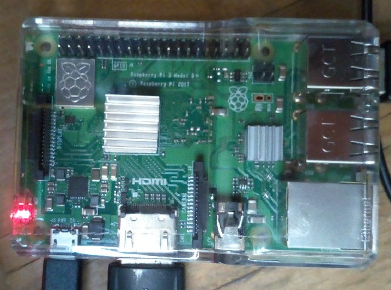

# koa-ipfs-blog-rpi

A light-weight web server that serves any website published to IPFS. It monitors a
BCH address and automatically updates when new content is announced by that
address. This repository focuses on the Raspberry Pi, the $50 credit-card sized
minicomputer, as a web server. This is what it looks like:



- [Here is a non-technical video](https://www.youtube.com/watch?v=RlNVyatwd5M) overview
of how governments censor content on the internet, and how decentralized publishing
tools can be used to circumvent it.

- [Here is a walkthrough video](https://www.youtube.com/watch?v=Ez9YXpu_Chs&t=971s) of
how to use this repository along with
the [memo-push](https://github.com/christroutner/memo-push) tool to publish a
website in a decentralized, censorship-resistant way in order to leverage the
[Streisand Effect](https://en.wikipedia.org/wiki/Streisand_effect).

This is the server-side software that serves up content to users with a normal
web browser. It also serves the content over IPFS and the Tor networks.
It works in conjunction with
the [memo-push](https://github.com/christroutner/memo-push) publishing
tool. Memo-push is used to announce new content via the BCH network. This
software is used to retrieve that new content from the IPFS network and serve
it to users. Future versions
will also serve content directly to the Tor network as well, via a hidden service.

This repository is forked
from [koa-ipfs-blog](https://github.com/christroutner/koa-ipfs-blog). It
targets Raspberry Pi (ARM) as the production server.
That project was forked from
the [koa-api-boilerplate](https://github.com/christroutner/koa-api-boilerplate)

## Installation & Raspberry Pi Setup
This document discusses the modifications necessary to run a 'production'
website off a Raspberry Pi mini computer. The directions below assume you
are starting with an RPi v3 B+ with a fresh installation of Raspbian OS.
All instructions below use the command line (terminal), not the graphical
user interface.

## Setup
- Clone this repository and enter it:
```bash
git clone https://github.com/christroutner/koa-ipfs-blog-rpi
cd koa-ipfs-blog-rpi
```

- (optional) Raspberry Pi comes loaded with educational software by default. If
you are running your Pi as a dedicated device for serving web pages, you don't
need all that bloat, and can save a lot of disk space by removing it. Run
this shell script to remove this software:
```bash
./scripts/init-rpi.sh
```

- Update the Raspbian OS:
```bash
sudo apt-get update
sudo apt-get upgrade -y
```

- If the below Docker instructions produce an error, try it again. The install
script for Docker and Docker Compose does not have robust retry logic, and will
usually throw an error if your internet has any hiccup.

- Install Docker on the RPi:
```
curl -sSL https://get.docker.com | sh
sudo usermod -aG docker pi
```

- Log out, then back in. Ensure you can run this command to confirm that Docker
is installed and working correctly: `docker ps -a`

- Install Docker Compose:
```
sudo apt-get install -y python python-pip libffi-dev libssl-dev
sudo pip install docker-compose
```

- Add your BCH address
to [the config file](ipfs-config/common.js). This
should be the same address associated with your
[memo.cash](https://memo.cash) profile.

- Run the docker container: `docker-compose up`

- Or, run the docker container in daemon mode: `docker-compose up -d`

**Note:** It takes time for the container to crawl the IPFS peer-to-peer network
and connect to peers, in order to find the initial content it wants to download.
You can speed up this processes by pre-downloading the initial content into the
`ipfs-data` directory.

**Note:** Your website will be able to be accessed directly over the Tor network.
The .onion address for your website can be found in `keys/koa/hostname`.

## Usage
Your device will now automatically pull down updated content from the IPFS network,
and serve that content over IPFS, the web, and Tor. It will automatically
start up the software if you reboot your RPi.

You announce updates to your content by using
the [memo-push](https://github.com/christroutner/memo-push) tool. The server will
monitor the BCH address associated with
your [memo.cash](https://memo.cash) profile and auto-update.

## License
[MIT](LICENSE.md)
